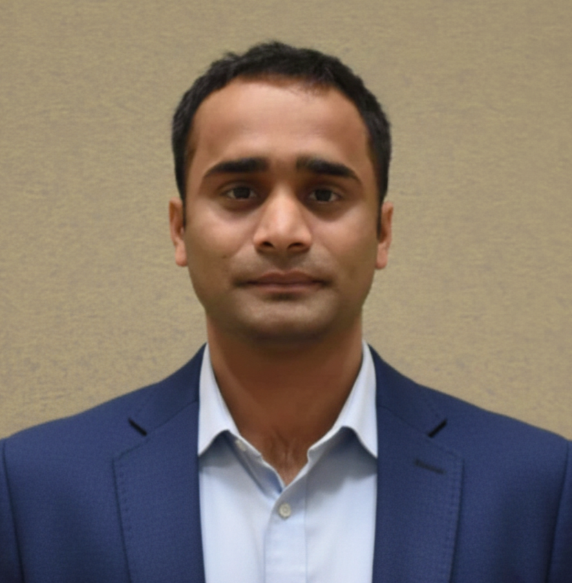

---
hide:
  - toc
  - navigation
---
<!--
CHECKLIST FOR THIS PAGE:
- [ ] Replace [YOUR NAME] with your full name (3 places)
- [ ] Replace [YOUR JOB TITLE] with your current or target role
- [ ] Replace [YOUR TAGLINE] with a short phrase describing your focus
- [ ] Rewrite the About Me paragraph with your own words
- [ ] Replace assets/images/profile.png with your actual photo (keep the filename or update it below)
- [ ] Replace assets/images/about.png with your own image (a field photo, map, or workspace shot)
- [ ] Edit the skill cards to match your actual skills (add, remove, or rename cards as needed)
- [ ] Update GitHub and LinkedIn links in the Connect section
- [ ] Add your CV PDF to docs/assets/ and update the filename in the Download CV button
-->

  
  <h1>Sujan Parajuli</h1>
  
<strong>Geospatial Consultant</strong>

  
<em>Turning spatial data into insights | GIS | Remote Sensing | LiDAR | Data Science | Machine Learning | ArcGIS Pro | QGIS | HPC | Cloud Computing | Python | R | WebGIS </em>

---

## About Me

I am dedicated Certified (GISP 162370) Geospatial Data Professional with proven expertise in
remote sensing, geospatial data management, and GIS application development for federal and
environmental programs.

With experience at USGS EROS, NOAA NMFS, and the Arizona Department of Environmental Quality (ADEQ), 
I have led transformative projects applying remote sensing, machine learning, and cloud GIS to solve critical challenges in ecosystem monitoring and environmental data management.

At USGS, I advanced automated workflows for large-scale invasive species mapping across the western U.S., integrating satellite imagery with AI-based land cover models. At ADEQ, I modernized GIS and data systems for statewide environmental programs, developing spatial tools and survey applications that improved community engagement and PFAS sampling operations.

As a co-author of several peer-reviewed publications, I demonstrate a commitment to advancing geospatial research and open, reproducible science. My vision centers on democratizing access to geospatial intelligence and empowering agencies to make data-driven environmental decisions.

  

---

[View My Projects :material-arrow-right:](projects/index.md){ .md-button .md-button--primary }
[Download CV :material-download:](assets/Sujan-CV.pdf){ .md-button }

---

## Skills

-   :material-layers:{ .lg .middle } **GIS & Remote Sensing**

    ---

    - QGIS, ArcGIS Pro, Google Earth Engine
    - GDAL / OGR, GRASS GIS
    - Multispectral and SAR image analysis
    - Cloud Native Geospatial (COG, STAC, Zarr)

-   :material-code-braces:{ .lg .middle } **Programming**

    ---

    - Python — GeoPandas, NumPy, Pandas, Matplotlib
    - R — sf, terra, ggplot2
    - JavaScript — Leaflet, MapLibre GL
    - SQL, PostgreSQL + PostGIS

-   :material-star-four-points:{ .lg .middle } **Machine Learning & GeoAI**

    ---

    - Supervised classification — Random Forest, XGBoost
    - Deep learning for image segmentation — U-Net, SAM
    - scikit-learn, PyTorch, TensorFlow
    - Object detection in satellite imagery

-   :material-earth:{ .lg .middle } **Web Mapping & Data**

    ---

    - Leaflet.js, Folium, MapLibre GL JS
    - Cloud storage — AWS S3, Google Cloud Storage
    - Data formats — GeoTIFF, GeoParquet, NetCDF
    - Streamlit for data-driven web apps

-   :material-database:{ .lg .middle } **Data & Cloud**

    ---

    - PostgreSQL + PostGIS
    - Cloud storage: AWS S3, Google Cloud Storage
    - Data formats: GeoJSON, GeoTIFF, NetCDF, Zarr, GeoParquet

-   :material-airplane:{ .lg .middle } **Drone / UAV Data Processing**

    - Mission planning and flight operations
    - Photogrammetry: Agisoft Metashape, OpenDroneMap
    - Point cloud processing: CloudCompare, PDAL

---

## Connect

[GitHub](https://github.com/SujanParajuli-GISP){ .md-button }
[LinkedIn](https://www.linkedin.com/in/sujanparajuli9/){ .md-button }
