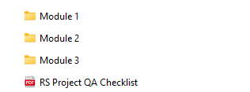
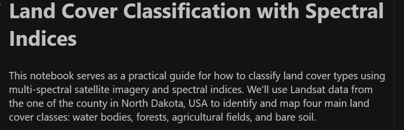

---
hide:
  - toc
  - navigation
---
<!--
CHECKLIST FOR THIS PAGE:
- [ ] Replace the two placeholder cards (marked [YOUR PROJECT ...]) with your real projects
- [ ] For each project: add a thumbnail image to docs/assets/images/ and update the path below
- [ ] For each project: create a project page by copying sample-project.md
- [ ] For each project: add a nav entry in mkdocs.yml (see the comments there)
- [ ] Delete placeholder cards you don't need yet
-->

# Projects

A number of exciting full end-to-end pipeline remote sensing and GIS projects coming soon!!

**[Remote Sensing Projects](sample-project.md)**

Remote Sensing Projects Coming Soon !!

`Python` `GEE` `ML`

[View Project →](sample-project.md){ .md-button }

**[Land Cover Classification using Multispectral Imagery](sample-notebook.ipynb)**

Coming Soon !!

`Python` `pandas` `Folium`

[View Project →](sample-notebook.ipynb){ .md-button }

<!--  -->

**[Downloading DEM OpenTopography](Module_1_Downloading_DEM_OpenTopography.ipynb)**

`Python` `geopandas` `rasterio`

[View Project →](Module_1_Downloading_DEM_OpenTopography.ipynb){ .md-button }

