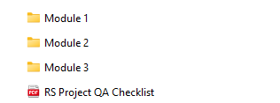
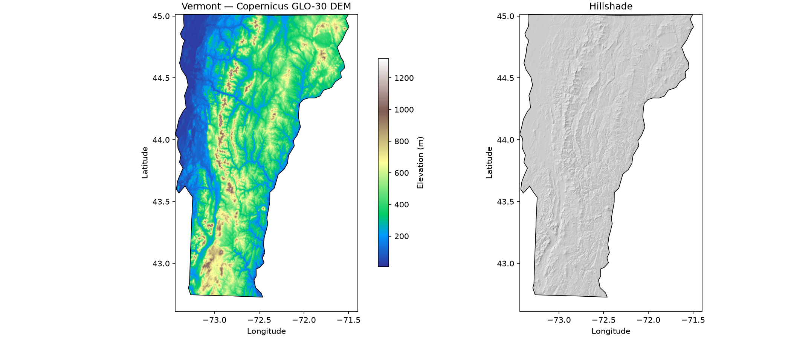
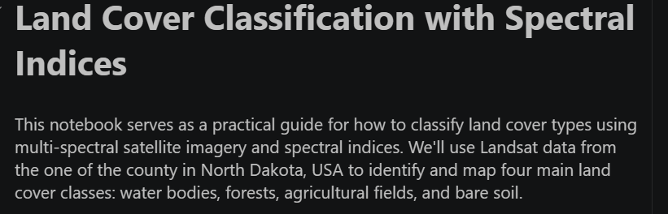
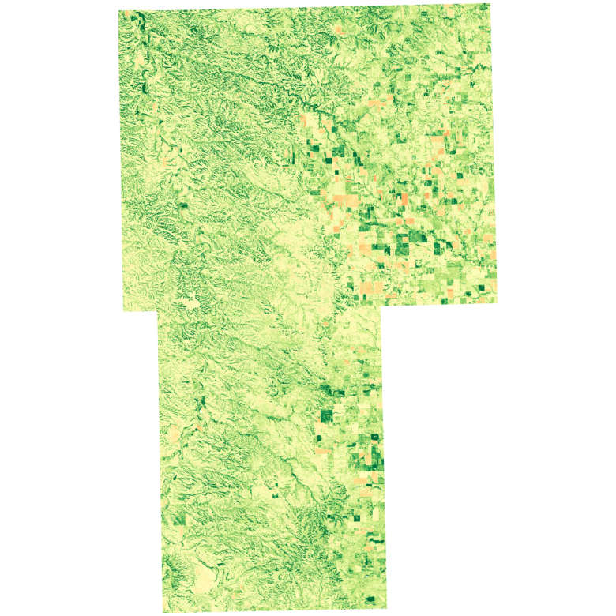

---
hide:
  - toc
  - navigation
---

# Projects

Open-source geospatial pipelines, tutorial courses and web applications — built with Python,
Google Earth Engine, PostGIS and machine learning.

!!! note "Repository access"
    Projects marked **Public** link to their GitHub repository. Course and tutorial materials
    marked **On request** live in private repositories; I'm happy to share them —
    [contact me](../contact.md).

## Applications & Web

**[Nepal Hydro-Climatic Risk Atlas](risk-atlas.md)**

Flood and groundwater risk mapping for Nepal with Earth Engine, Random Forests and SHAP, served as a live Streamlit dashboard.

`Python` `GEE` `ML` `SHAP` `Streamlit` · **Public**

[View Project →](risk-atlas.md){ .md-button }

**[GEE-O-Spatial Company Website](gee-o-spatial.md)**

Website for a geospatial consulting, training and SaaS company, deployed with GitHub Actions.

`MkDocs` `GitHub Pages` · **Public**

[View Project →](gee-o-spatial.md){ .md-button }

## Courses & Tutorials

**[100 Remote Sensing Applications](rs-100-applications.md)**

One working, spec-driven application for each of 100 remote sensing use cases. Overview only — full details on request.

`Python` `PostGIS` `FastAPI` · **On request**

[View Overview →](rs-100-applications.md){ .md-button }

**[Geodatabase Management for Backend GIS Developers](geodatabase-course.md)**

A code-first PostgreSQL/PostGIS course — 13 Colab notebooks and a FastAPI capstone.

`PostGIS` `SQL` `FastAPI` · **On request**

[View Project →](geodatabase-course.md){ .md-button }

**[GIS Project Examples & Tutorials](gis-modelbuilder-python.md)**

Open-source Python recreations of ArcGIS ModelBuilder labs: suitability, fuzzy overlay, movement, hydrology, network tracing and location-allocation.

`GeoPandas` `Rasterio` `Folium` · **On request**

[View Project →](gis-modelbuilder-python.md){ .md-button }

**[Remote Sensing with Python — Three-Course Program](rs-gis-course.md)**

Python, remote sensing and Earth Engine from fundamentals to advanced ML: 9 units, 60 lecture decks, 20 Colab labs.

`Python` `GEE` `ML` · **On request**

[View Project →](rs-gis-course.md){ .md-button }

## Notebooks

**[Download & Clip a DEM for Any U.S. State](Module_1_Downloading_DEM_OpenTopography.ipynb)**

Open-data, no-API-key notebook that builds a state-shaped DEM and hillshade from Copernicus GLO-30. Runs in Google Colab.

`Python` `GeoPandas` `Rasterio` · **Public**

[View Notebook →](Module_1_Downloading_DEM_OpenTopography.ipynb){ .md-button }
[Open in Colab](https://colab.research.google.com/github/SujanParajuli-GISP/SujanParajuli/blob/main/docs/projects/Module_1_Downloading_DEM_OpenTopography.ipynb){ .md-button }

**[A Tour of the Python Geospatial Stack](Module_1_Ex02_Geospatial_Libraries.ipynb)**

Shapely, Fiona, GeoPandas, Rasterio, Xarray, Rioxarray, SciPy, Folium, Leafmap, Rasterstats, Matplotlib and Plotly on real open data.

`Python` `GeoPandas` `xarray` · **Public**

[View Notebook →](Module_1_Ex02_Geospatial_Libraries.ipynb){ .md-button }
[Open in Colab](https://colab.research.google.com/github/SujanParajuli-GISP/SujanParajuli/blob/main/docs/projects/Module_1_Ex02_Geospatial_Libraries.ipynb){ .md-button }

**[Raster Processing: DEM Terrain and Sentinel-2 NBR](Module_1_Ex03_Raster_Processing.ipynb)**

Reproject, clip and analyse a DEM, derive slope, aspect and hillshade, and compute NBR from Sentinel-2 — all from keyless open data.

`Python` `Rasterio` `Sentinel-2` · **Public**

[View Notebook →](Module_1_Ex03_Raster_Processing.ipynb){ .md-button }
[Open in Colab](https://colab.research.google.com/github/SujanParajuli-GISP/SujanParajuli/blob/main/docs/projects/Module_1_Ex03_Raster_Processing.ipynb){ .md-button }

**[Vector Processing with GeoPandas](Module_1_Ex04_Vector_Processing.ipynb)**

Read, filter, reproject, measure, map, dissolve and join North Dakota census data, with optional ACS demographics.

`Python` `GeoPandas` `Census` · **Public**

[View Notebook →](Module_1_Ex04_Vector_Processing.ipynb){ .md-button }
[Open in Colab](https://colab.research.google.com/github/SujanParajuli-GISP/SujanParajuli/blob/main/docs/projects/Module_1_Ex04_Vector_Processing.ipynb){ .md-button }

**[Interactive Web Maps with Folium](Module_1_Ex05_Folium_Interactive_Maps.ipynb)**

Markers, routing with OSRM, county and road layers, layer controls, heatmaps and clusters — saved as shareable HTML.

`Python` `Folium` `OSRM` · **Public**

[View Notebook →](Module_1_Ex05_Folium_Interactive_Maps.ipynb){ .md-button }
[Open in Colab](https://colab.research.google.com/github/SujanParajuli-GISP/SujanParajuli/blob/main/docs/projects/Module_1_Ex05_Folium_Interactive_Maps.ipynb){ .md-button }

