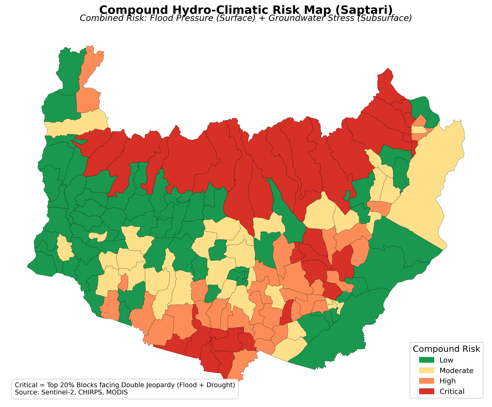

---
hide:
  - toc
---

# Nepal Hydro-Climatic Risk Atlas

*An integrated decision-support system for flood and groundwater risk assessment.*

[:material-open-in-new: Live dashboard](https://region-risk-atlas-nepal.streamlit.app/){ .md-button .md-button--primary }
[:fontawesome-brands-github: Source code](https://github.com/SujanParajuli-GISP/regoin-risk-atlas){ .md-button }

`Google Earth Engine` `scikit-learn` `SHAP` `Streamlit` `GeoPandas` `Folium`

## Overview

Nepal faces a hydrological paradox: the same municipal units often suffer **floods** in the
monsoon and **groundwater depletion** in the dry season. This project builds a single
**Compound Risk Index** that highlights where both hazards overlap, and serves it through an
interactive dashboard so planners can prioritise interventions such as Managed Aquifer Recharge.

The pipeline was first built for Saptari district and then generalised into a repeatable,
per-district workflow. It currently scores municipal units in **45 of Nepal's 77 districts**
and can be extended to the rest.

## Method

1. **Data acquisition (Google Earth Engine)** — 2019–2025 time series per block from CHIRPS
   rainfall, MODIS evapotranspiration and Sentinel-2 NDVI.
2. **Flood pressure model** — Random Forest regressor (R² > 0.85) driven by 3-month
   cumulative rainfall, rainfall anomaly against the 30-year mean, and NDVI.
3. **Groundwater stress model** — Random Forest regressor driven by evapotranspiration,
   rainfall and their ratio.
4. **Explainable AI** — SHAP shows *why* a block scores high. It reveals a tipping point:
   groundwater stress rises sharply once the ET-to-rainfall ratio exceeds about 7.
5. **Compound score** — both indices are min-max normalised and averaged 50/50; the top 20 %
   of blocks are classed as *Critical*.
6. **Trend analysis** — an OLS slope over 2019–2025 gives each block a degradation rate
   (rising stress) or recovery rate (falling stress).
7. **Web app** — a Streamlit dashboard with maps, filters and trend metrics.

## What is in the repository

- Three step-by-step notebooks: boundary preparation, GEE extraction, and
  feature merging / modelling / final outputs.
- Command-line scripts to extract, score and publish any district.
- `TUTORIAL.md` — an end-to-end guide from GEE extraction to Streamlit Cloud deployment.

!!! note "Attribution"
    Adapted from the open-source [explolar/bihar-risk-atlas](https://github.com/explolar/bihar-risk-atlas)
    project, modified and extended for Nepal by Sujan Parajuli. MIT licensed.
